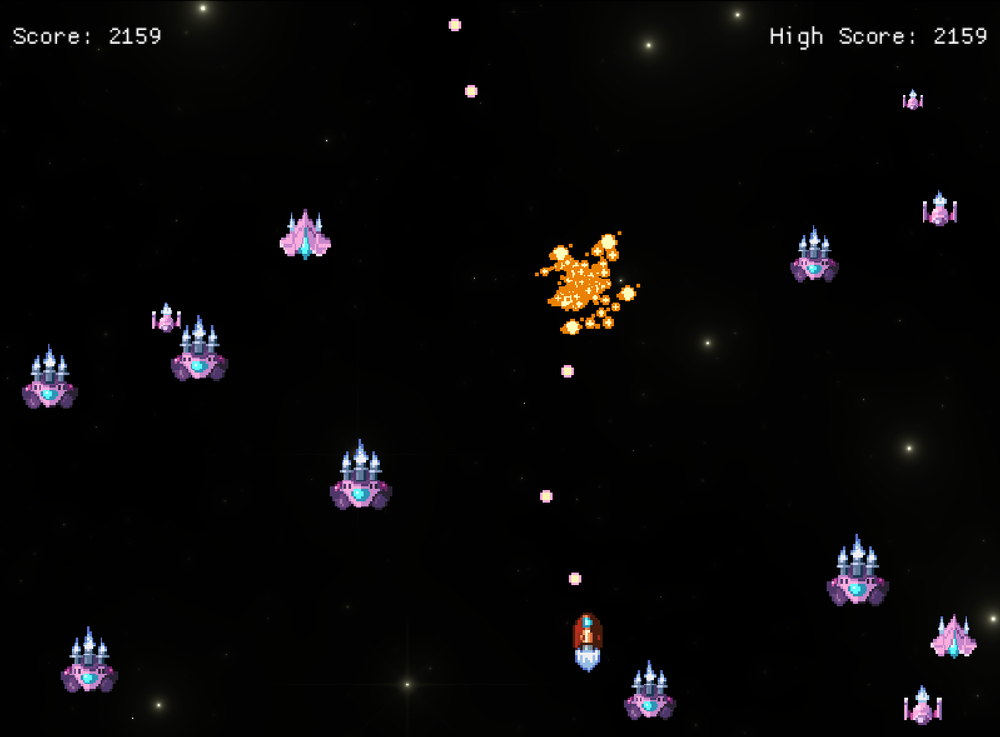

# Space Shooter

2D space shooter made with Rust and Macroquad. 👾

 

 

**Download:** https://github.com/hexensemble/space-shooter/releases

 

**Controls:**
- W = Up
- A = Left
- S = Down
- D = Right
- SPACE = Shoot
- Also supports Vim based movement with HJKL

 

This project was built upon the excellent tutorial "Game development in Rust with Macroquad" by Olle Wreede:
https://mq.agical.se

Additional credits:
https://mq.agical.se/credits.html

Licence:
https://mq.agical.se/copyright.html
